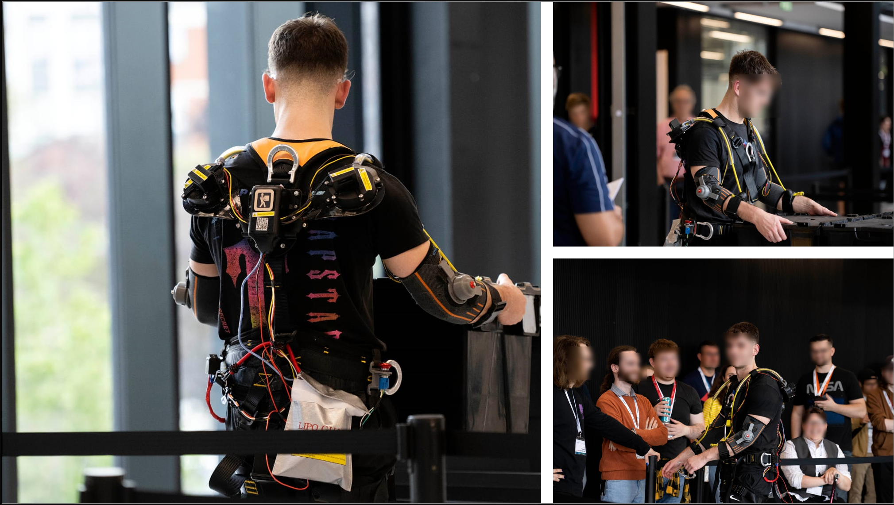

<a name="readme-top"></a>

<!-- PROJECT SHIELDS -->
<!--
*** Project Shields will go here once the project is publically available.
-->

<!-- PROJECT LOGO -->
<div align="center">
    
  <br />
  <h3 align="center">
  
  </h3>

  <p align="center">
    UCLAN Quasi-active Exoskeleton - Exo Games 2023 Winner
    <br />
    <a href="https://github.com/LeonidasEng/Exoskeleton/issues">Report Bug</a>
    ·
    <a href="https://github.com/LeonidasEng/Exoskeleton/issues">Request Feature</a>
  </p>
</div>



<!-- TABLE OF CONTENTS -->
<details>
  <summary>Table of Contents</summary>
  <ol>
    <li>
      <a href="#about-the-exo-games">About The Exo Games</a></li>
    <li><a href="#about-B.A.L.A.N.C.E">About B.A.L.A.N.C.E</a></li>
    <li> 
      <ul>
        <li><a href="#built-with">Built With</a>
      </ul>
    </li>
    <li><a href="#roadmap">Roadmap</a></li>
    	  <ul>
        <li><a href="#sprint-1-wokwi-simulation">Sprint 1 Wokwi Simulation</a></li>
        <li><a href="#sprint-2-preparation-with-feature-exploration">Sprint 2 Preparation with Feature exploration</a></li>
        <li><a href="#sprint-3-sprint-3-active-testing">Sprint 3 Active testing</a></li>
        <li><a href="#sprint-4-race-to-the-finish-line!">Sprint 4 Race to the finish line!</a></li>
      </ul>
	  </li>
    <li><a href="#changelog">Changelog</a></li>
    <li><a href="#contributing-internal">Contributing - Internal</a></li>
    <li><a href="#contributing-external">Contributing - External</a></li>
    <li><a href="#license">License</a></li>
    <li><a href="#contact">Contact</a></li>
    <li><a href="#acknowledgments">Acknowledgments</a></li>
  </ol>
</details>


<!-- ABOUT THE PROJECT -->
## About The Exo Games
<details open>
<summary>Click to expand/collapse</summary>
ASTM International’s Exo Technology Center of Excellence (ET CoE) is sponsoring the Exo Games, a new initiative to improve student involvement and education in the exo technologies industry.

The Exo Games is a competition open to university teams of S.T.E.M degree students, designed to connect them with exo industry professionals, help them build lifelong relationships, and get hands-on experience with new exo standards.  Team slots are on a first come first served basis and ASTM reserves the right to limit the number of teams due to space and logistic considerations."

Working in teams, students must design, build, and test a self-contained exoskeleton from a project specification provided to them. From this specification they must produce a design solution, make it, test it with the predefined ASTM standards, and compete to win a grand prize. The Games will be hosted by the University of Central Lancashire (UCLan) in Lancashire, England.

Each team can use just one exoskeleton device at the competition, but all students who work on the challenge will benefit from the learning experience of applying their technical knowledge. The competition has four main areas for the teams to excel:

1. Main Competition - Design, build and test an exo technology device to compete with other teams.

2. Design Competition - Create a virtual prototype of your device.

3. Poster Competition - Produce a poster to publicize the teams’ work. The poster is a demonstration of the team’s ability to sell their design solution pictorially.

4. Presentation Competition - Give a short presentation explaining the design and development of their device to demonstrate their verbal & presentational skills.
</details>

<!-- About Project -->
## About B.A.L.A.N.C.E
<details>
<summary>Click to expand/collapse</summary>

The Body Assisted Lifting and Naturalistic Control Exoskeleton (B.A.L.A.N.C.E) is a quasi-active exoskeleton. The top half of the exoskeleton assists the exo pilot with lifting, it achieves this through the use of two bungee cords which are connected to spools located over the shoulder blades. The spools are controlled by two Dynamixel XM430-W210-R Smart Actuators. 
<br />
The control system is an Arduino Mega 2560 which has a HC-05 Bluetooth module which can provide real-time feedback to the pilot via their mobile phone. 
<br />
Based on the task, the pilot has the ability to choose between three tension settings, using a switch located on their exo belt. A 40N strength, a 25N dexterity, and a release setting which turns the tension off. There is also a Normally-Closed emergency stop located on the belt in the event of an emergency. When a setting has been engaged, potentiometers located at the left and right elbow joint can actively increase or decrease tension based on arm position. The system is all powered by a rechargable lithium ion & power bank pack which can provide 11.1V to the actuators and 5V to the Arduino controller for over 40 minutes of use.
<br />

### Built With
* C/C++
* Arduino
* Dynamixel2Arduino
* DynamixelShield
* Wokwi Online Simulator
* SolidWorks
* Ansys

</details>


<p align="right">(<a href="#readme-top">back to top</a>)</p>

<!-- ROADMAP AND CHANGELOG -->
## B.A.L.A.N.C.E - Roadmap
<details>
<summary>Click to expand/collapse</summary>

### Sprint 1 Wokwi Simulation
<a href="https://wokwi.com/projects/365491902229667841">View Sprint 1 Simulation</a>
- [x] Created basic circuit.
- [x] Added components for 4 Stepper motor control.
- [x] Developed and refactored code to improve system modularity and functionality.
	- [x] Implementing AccelStepper.h library.
	- [x] Button gesture control.
	- [x] Reset to Origin feature.
- [x] New version using only 2 Steppers.
- [x] Testing with Mechanical System.

### Sprint 2 Preparation with Feature exploration
- [x] Ordered materials for project.
- [x] Exploring pot control using cont. servos.
- [x] Dynamixel SDK research.
- [x] Dynamixel Shield research.
- [x] Dynamixel2Arduino and XM430-W210-R research.
- [x] First script draft and flex sensor idea. 

### Sprint 3 Active testing
- [x] Requirements Analysis for Dynamixel motors.
- [x] Minimum Viable Product (MVP) strategy.
- [x] 1 Dynamixel motor working with 3-way switch (breadboard switch).
- [x] 2 Dynamixel motor working with 3-way switch (breadboard switch). 
- [x] Pilot Trial: Testing with right shoulder-wing.
- [x] Code Refactoring.
- [x] Error Handling.
- [x] Pilot Trial: Full System

### Sprint 4 Race to the finish line!
- [x] Calibration
- [x] Integration of HC-05 Module
- [x] Potentiometer control for Dynamixel motors.
- [x] System Refinement
- [x] Pilot Trial: Complete System
- [x] Troubleshooting and Final Checks
- [x] Demonstration at Exogames 2023  
</details>
<p align="right">(<a href="#readme-top">back to top</a>)</p>

### Competition Result
Winner of ASTM’s Exo Games 2023: Award for designing, building, and testing an exoskeleton that demonstrates the augmentation of balance, strength, dexterity, speed, and stamina, while fulfilling ASTM standards.

Winner of ASTM’s Exo Games 2023 Poster competition: Award for displaying and describing the competing exoskeleton clearly through utilisation of diagrams, technical explanations, and engineering principles.

## Changelog
You can find the changelog for this repo here: [Changelog](https://github.com/LeonidasEng/Exoskeleton/blob/main/CHANGELOG.md)

See the [open issues](https://github.com/LeonidasEng/Exoskeleton/issues) for a full list of proposed features (and known issues).

<p align="right">(<a href="#readme-top">back to top</a>)</p>

<!-- CONTRIBUTING -->
## Contributing - Internal
### Accept the Invite
1. To be granted access to this repo, you will receive an invitation link via your UCLAN email address.
2. You need to click on the link provided in the notification to accept the invitation.
3. If you don't have a GitHub account, you will be prompted to create one before accepting the invitation.

### Clone the Repo
1. Once you have accepted the invitation, you need to clone the repository to your local machine.
2. On the repository page, click on the green "Code" button.
3. Copy the HTTPS or SSH URL of the repository (you can toggle between the two options).
4. Open a terminal or command prompt on your local machine.
5. Navigate to the directory where you want to clone the repository.
6. Run the following command for HTTPS:
    ```sh
    git clone https://github.com/LeonidasEng/Exoskeleton.git
    ```
### Accessing the Repo
1. After cloning the repository, you can access its contents on your local machine.
2. You can make changes, add files, or create branches within the repository based on the permissions granted to you.

### Push changes
1. Once you've made changes to the repository, you can push those changes back to GitHub.
2. In the terminal or command prompt, navigate to the repo's directory.
3. Run the following commands to stage, commit, and push the changes:
    ```sh
    git add .
    git commit -m "Enter a descriptive commit message"
    git push
    ```
That's it now you can collaborate on the project with the rest of the team!

## Contributing - External
This project was done as part of the competition, future Exo Games projects will work to a different brief. However, any feedback you can give is **greatly appreciated**.

If you have a suggestion that would make this better, please fork the repo and create a pull request. You can also simply open an issue with the tag "enhancement".

1. Fork the Project
2. Create your Feature Branch (`git checkout -b feature/NewFeature`)
3. Commit your Changes (`git commit -m 'Add some NewFeature'`)
4. Push to the Branch (`git push origin feature/NewFeature`)
5. Open a Pull Request

<p align="right">(<a href="#readme-top">back to top</a>)</p>

<!-- LICENSE -->
## License
This source code is licensed under the GPLv3-style license found in: [LICENSE](https://github.com/LeonidasEng/Exoskeleton/blob/main/LICENSE) file in the root directory of this source tree.

<p align="right">(<a href="#readme-top">back to top</a>)</p> 

## Team Member roles
Leo Hayes - Developer - leo.m.hayes@hotmail.co.uk

Five other team members and their roles (anon):
Technical Lead, Systems Designer(s), CAD Specialist, Administrator.


Project Link: [https://github.com/LeonidasEng/Exoskeleton](https://github.com/LeonidasEng/Exoskeleton)

<p align="right">(<a href="#readme-top">back to top</a>)</p>

<!-- ACKNOWLEDGMENTS -->
## Acknowledgments
* [AccelStepper Class Reference](https://www.airspayce.com/mikem/arduino/AccelStepper/classAccelStepper.html)
* [AccelStepper - The Missing Manual](https://hackaday.io/project/183279-accelstepper-the-missing-manual/details)
* [Arduino with TB6600 using AccelStepper library](https://curiousscientist.tech/blog/arduino-accelstepper-tb6600-walkthrough)
* [Best-README-Template](https://github.com/othneildrew/Best-README-Template)
* [Slawomir Korbas](https://www.youtube.com/@slawomirkorbas)
* [Dynamixel-Shield-Toolbox by nikwl](https://github.com/nikwl/dynamixel-shield-toolbox)
* [Dynamixel XM430-W210-T/R](https://emanual.robotis.com/docs/en/dxl/x/xm430-w210/)

<p align="right">(<a href="#readme-top">back to top</a>)</p>


<!-- MARKDOWN LINKS & IMAGES -->
<!--
*** Shields to be added when project is public:
*** [contributors-shield]: 
*** [contributors-url]: 
*** [forks-shield]: 
*** [forks-url]:
*** [stars-shield]: 
*** [stars-url]: 
*** [issues-shield]: 
*** [issues-url]: 
*** [license-shield]: 
*** [license-url]: 
*** [linkedin-shield]: 
*** [linkedin-url]: 
*** [project-banner]: 

-->